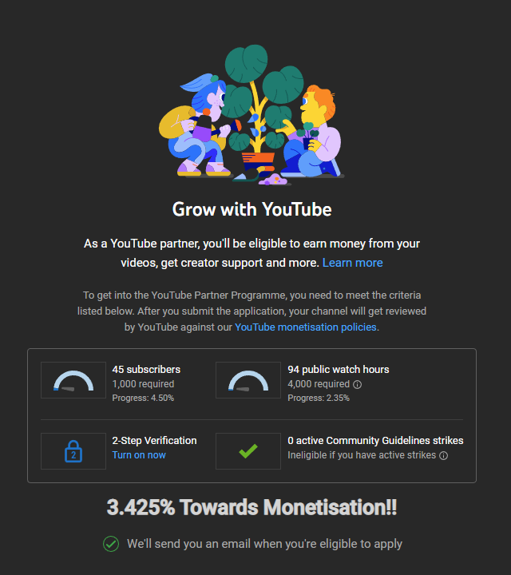

# YT Monetization Tracker
This simple chrome extension watches for youtube studio pages and then modifys the monetisation page to show a percentage value for towards monetization. See image below;

# How To Install & Use: 
- Download this project as zip file
- Extract zip file to desired folder
- Open Google Chrome
- Open Extensions Page (chrome://extensions/)
- Enable Developer Mode (toggle switch, top right)
- Click 'Load Unpacked' 
- Select the folder where you extracted the zipped files. 
- Load youtube studio and see your monetizationn progress!

# dekitarpg.com